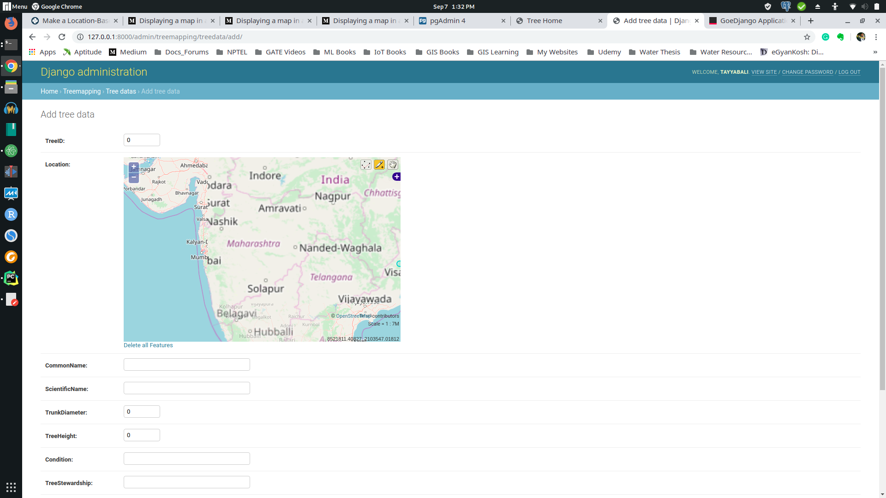

In this post we will learn about the basic steps required to setup geodjango

<!--more-->

Code repository : https://github.com/tayyabsayyad/treemapping

## Tools required

1. Python 3
2. pip package manager
3. virtualen for manageing virtual envirnments
4. Django
5. Geodjango
6. Postgresql
7. postgis GIs extension for the Postgresql
8. pgadmin for manageing the databases
9. pycharm or Atom code editor
10. Geoserver for serving maps
11. psycopg2 for Python postgre adaptor
12. Android Studio

# Setup the project

1. Create a virtual Envirnment ( Install Virtualenv tool in you system if not installed)

        python3 -m venv env

2. Activate the envirnment

         source env/bin/activate

3. Install Django ( Install pip if not installed in system)

        pip install django

4. Create Project

        django-admin.py startproject tree

4. Configure the posgreSQL database

          DATABASES = {
          'default': {
          'ENGINE': 'django.contrib.gis.db.backends.postgis',
          'NAME': 'database_name',
          'USER': 'user_name_database',
          'PASSWORD': 'password',
          'HOST': 'localhost',
          'PORT': '5432'
          }
          }

5. Install Required libraries

        pip install psycopg2-binary
        pip install geos
        pip install pyproj
        pip install geoip
        pip install django-leaflet

    To install the postgis and geoserver refer Post : <a href=''>Installation of PostGIS </a>

6. Add geodjango framework in the setting.py file

        INSTALLED_APPS = [
        # [...]
        'django.contrib.gis'
        ]

# Create Application

Now we will make Create the treemapping app, we will add its `model`, `migrate` the database, add `view` function and finally a `template` for frount end

1.  Create Application as treemapping

        python manage.py startapp shops

2. Add treemapping app into INSTALLED_APPS in setting.py

          INSTALLED_APPS = [
          # [.....]
          'django.contrib.gis'
          'treemapping',
          ]

3. Creating a model for tree mapping application  
    add following to the `treemapping/models`

          class TreeData(models.Model):
          treeID = models.IntegerField(default=0)
          location = models.PointField()
          commonName = models.CharField(max_length=100)
          scientificName = models.CharField(max_length=100)
          trunkDiameter = models.IntegerField(default=0)
          treeHeight = models.IntegerField(default=0)
          datePlanted = models.DateTimeField(auto_now=True)
          condition = models.CharField(max_length=100)
          treeStewardship = models.CharField(max_length=100)
          address = models.CharField(max_length=100)
          city = models.CharField(max_length=100)
          pincode = models.IntegerField(default=413405)

4. Creating Tables in the database

        python manage.py makemigrations
        python manage.py migrate

5. Add super user to your application

        python manage.py createsuperuser

6. Register Admin Module on `treemapping/admin.py`

        from django.contrib import admin
        from .models import TreeData

        admin.site.register(TreeData)

By default it will use openlayer for displaying map, if you want to use the openstreetmap then use folllwoing way to register admin Module

      from django.contrib.gis.admin import OSMGeoAdmin
      from django.contrib.gis import admin

      from .models import TreeData

      @admin.register(TreeData)
      class TreeAdmin(OSMGeoAdmin):
          list_display = ('location', 'city')

7. Finally run django server

        python manage.py runserver

    
